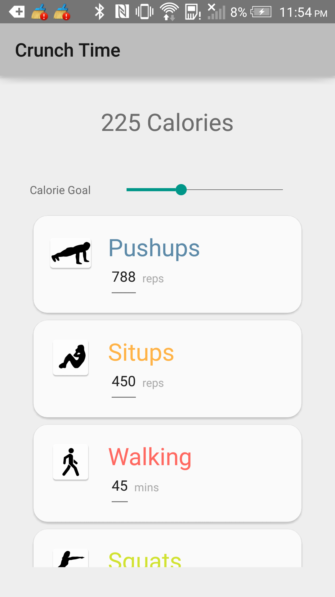
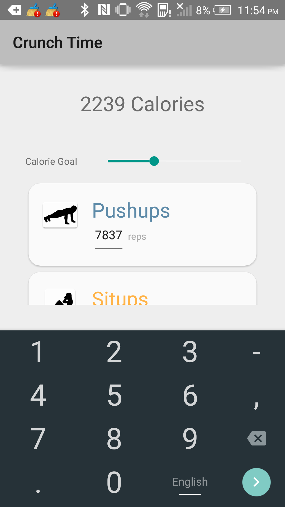
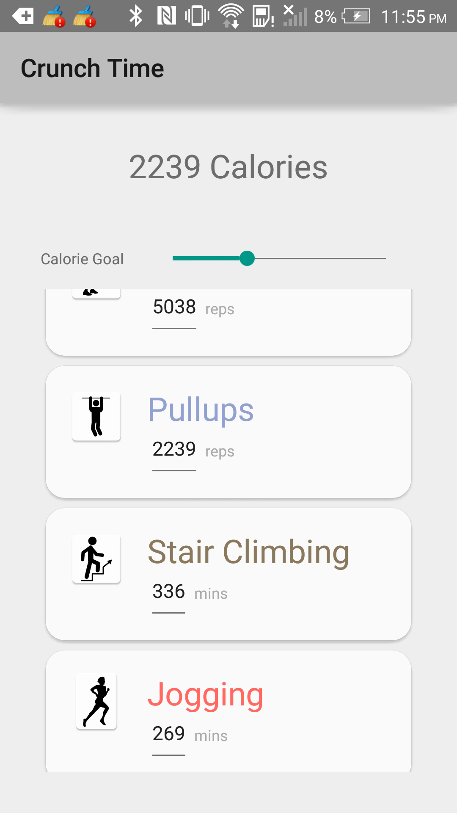

# PROG 01: Crunch Time

A fitness app that lets you set your calorie goals or find out how many calories you burned with a certain workout!
Supports a wide variety of workouts and has an intuitive layout that puts your calorie burning goals above all else!

## Interaction:

The app allows you to use a slider to choose a calorie burn target, which updates all the exercises below. You can also choose an exercise and fill in an amount of that exercies (reps or minutes) and get the equivalent in calories burned!
## Authors

Laith Alqaisi ([laithalq@berkeley.edu](mailto:laithalq@berkeley.edu))

## Demo Video

See [Crunch Time Demo - CS160] (https://vimeo.com/154399315)

## Screenshots

## Acknowledgments

* Hat tip to Android docs for being so thoroughly explained and exampled
* Google and Stack Overflow <3
